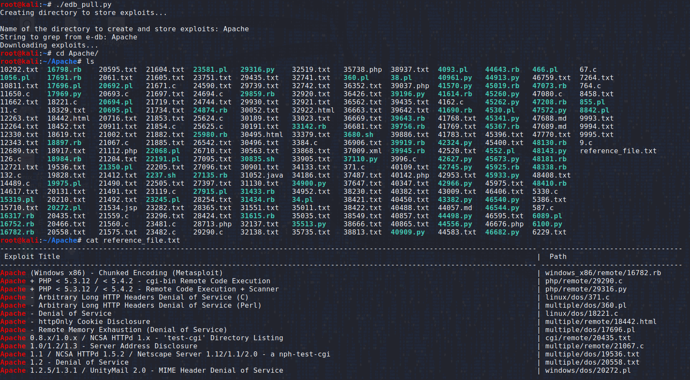

# edb_pull.py
Python script that searches the exploit database for a string that you designate and downlaods all matching exploits to
a directory with a reference file to match exploits with their desciptrion 

